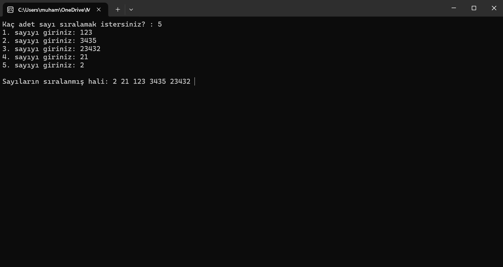
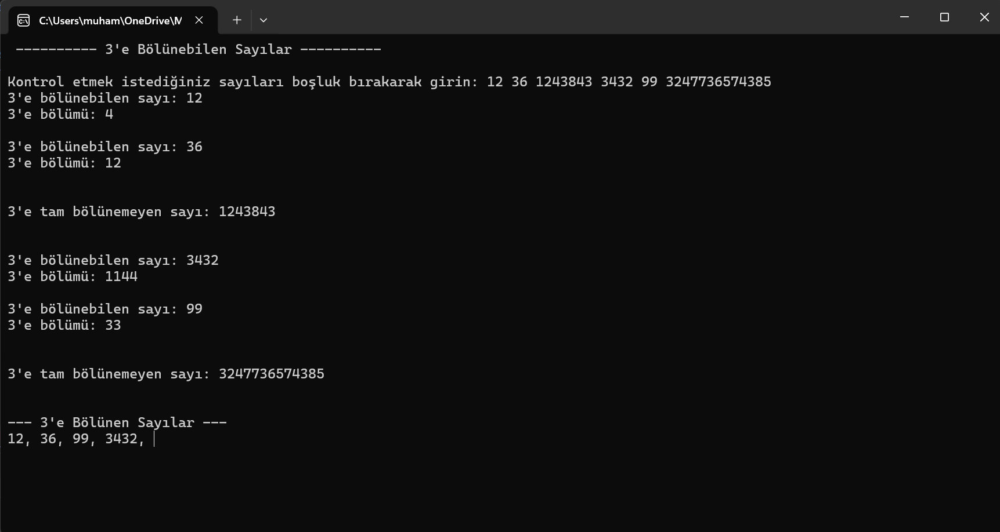
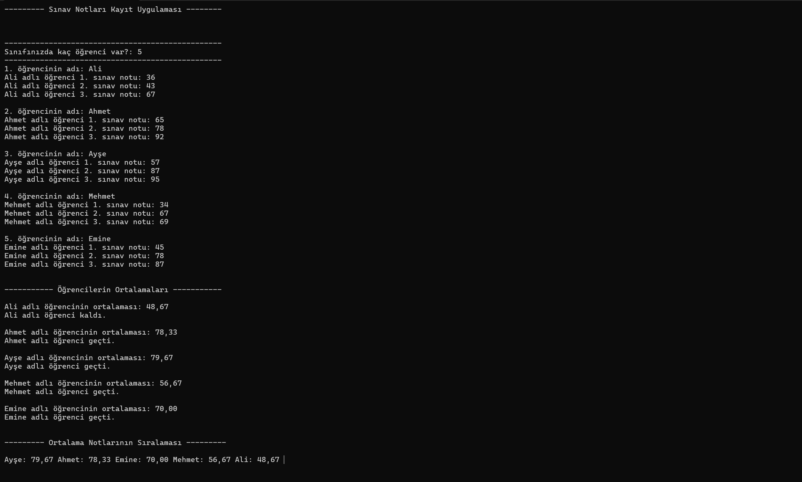

# 🚀 C# Eğitim Serüvenim ve Pratik Projelerim

Bu repository, C# diline adım attığım dönemde öğrendiklerimi pekiştirmek amacıyla geliştirdiğim küçük çaplı konsol (CLI) uygulamalarını içermektedir.

**Amacım:** C# dilinin temel yapılarını öğrenmek, mantığını kavramak ve teorik bilgileri pratik projelere dönüştürmektir.

---

## 📁 Proje Listesi

### 1. Sayı Sıralama ve Analiz Uygulaması

* Bu proje kullanıcıdan kaç adet sayı gireceğini alır, girilen sayıları bir diziye (`int[]`) atar ve küçükten büyüğe sıralayarak ekrana yazdırır.
* **Kullanılan Yapılar:** `int[]` dizisi, `for` ve `foreach` döngüleri, `Array.Sort()` metodu, `int.Parse()` dönüşümü.
 

 
📸 Ekran Görüntüsünü Görmek İçin Tıklayın

  
 
 

* ### 2. Üçün Katlarını Bulma ve Küçükten Büyüğe Sıralama
* Bu proje, kullanıcıdan alınan sayıların 3'e tam bölünüp bölünemediğini kontrol eder. 3'e bölünen sayıların bölme sonucunu hesaplar ve ardından bu sayıları küçükten büyüğe sıralı bir şekilde ekrana yazdırır.
* **Kullanılan Yapılar:** `Bigİnteger[]` dizisi, mod alma operatörü (`%`), `Array.Sort()` metodu, döngüler ve koşullu ifadeler (`if-else`).
 

 
📸 Ekran Görüntüsünü Görmek İçin Tıklayın

  
 
 

* ### 3. Sınav Notlarının Ortalamasını Bulma ve Büyükten Küçüğe Sıralama
* Bu proje, kullanıcıdan alınan sınıf mevcuduna göre öğrencilerin isimlerini ve her bir öğrencinin 3 adet sınav notunu kaydeder. Öğrencilerin ortalamalarını hesaplayarak geçti/kaldı durumlarını belirler ve tüm sınıfın ortalama notlarını büyükten küçüğe sıralı olarak ekrana yazdırır.
* **Kullanılan Yapılar:** Dinamik diziler (`string[]`, `double[]`), iç içe `for` döngüleri, `if-else` koşul yapıları, `Array.Sort()` ve `Array.Reverse()` metodları, `double.Parse()` dönüşümü, `:F2` string formatlama.

📸 Ekran Görüntüsünü Görmek İçin Tıklayın

 

